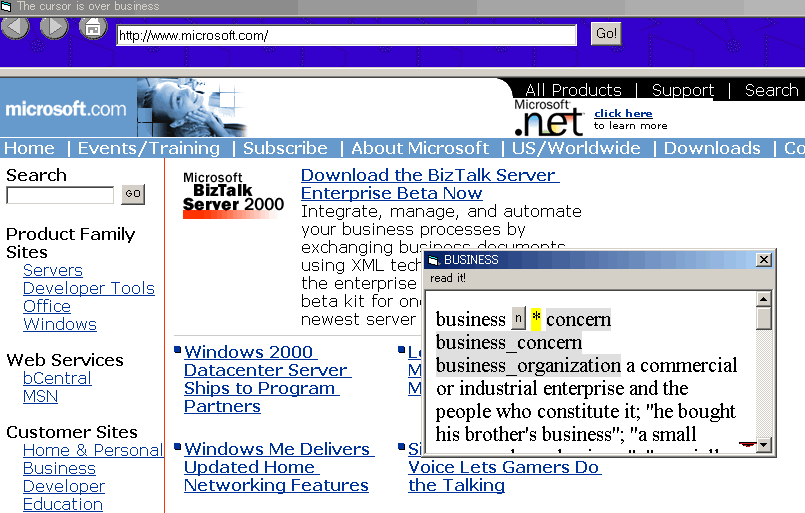

## English Explorer alpha 0\.02

### Description

* LAST BUG FIX SEP 19, 2000 * 

This English Explorer is a 'Microsoft WebBrowser contol' based browser.  

The original development site is http://www.yasuaki.com/eetp

  

When you right-click on any word in the browser,

a window pops up and shows, says the meaning of it. ( It actually passes arguments to URL and gets the rest from the Internet. You can customize the URL very easily)

  

This software was originally devleloped as an English training tool. THE CODE WORKS BUT IS *EXTREMELY UGLY*.

I had to abandon the development because of my busy job situation so I decided to release the code *as is* in a hope to keep it alive.

  

I'd like to make this open source but not sure if it's legally possible because I have used code from other authors on planet-source-code.com

  

anyway, MODIFICATION / FURTHER DEVELOPMENT IS ENCOURAGED. IF YOU HAVE QUESTIONS, PLEASE SEND THEM TO yasu@yasuaki.com

  

Requirements:

 * Visual Basic 6.0 ( or maybe later)

 * Internet Explorer 5.0 or 5.5 ( or maybe later)

 * Microsoft text-to-speech engine. ( I think Win2k has it by default ). If you don't have it, you can download the Microsoft Speech SDK from http://www.microsoft.com/iit/

  

BETTER TECHNOLOGIES WANTED: 

The most difficult and the core technology of this software is finding what word is under the mouse cursor. The current solution is to insert  tags on all the words but this isn't reliable and has a lot of bugs. It has difficulties with frames, too. If you can think of any other methods, please post them!!

  

other notes:

I've also included python-based script I run on my server to provide dictionary contents.  

checkout: 

http://www.yasuaki.com/eetp/external/eewnburst.cgi?word=business

 

for instance.

  

keywords:

 

EnglishExplorer english explorer microsoft webbrowser web browser control IE5 IE5.5 Internet explorer popup pop up window right click right-click rightclick TTS text-to-speech text to speech
 
### More Info
 

             |
---                |---
**Submitted On**   |2000-09-19 14:53:08
**By**             |[Yasuaki Kudo](https://github.com/Planet-Source-Code/PSCIndex/blob/master/ByAuthor/yasuaki-kudo.md)
**Level**          |Intermediate
**User Rating**    |4.2 (21 globes from 5 users)
**Compatibility**  |VB 6\.0
**Category**       |[Internet/ HTML](https://github.com/Planet-Source-Code/PSCIndex/blob/master/ByCategory/internet-html__1-34.md)
**World**          |[Visual Basic](https://github.com/Planet-Source-Code/PSCIndex/blob/master/ByWorld/visual-basic.md)
**Archive File**   |[CODE\_UPLOAD99699192000\.zip](https://github.com/Planet-Source-Code/yasuaki-kudo-english-explorer-alpha-0-02__1-11014/archive/master.zip)

